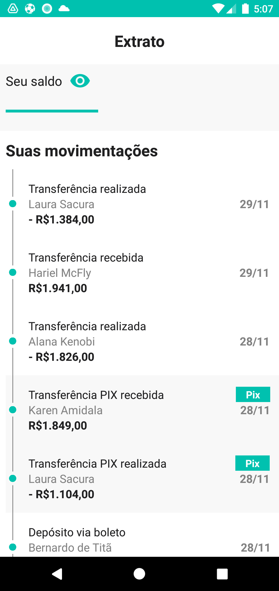
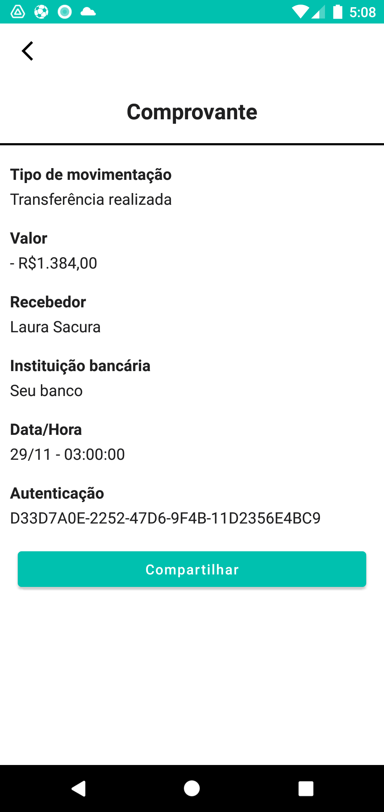
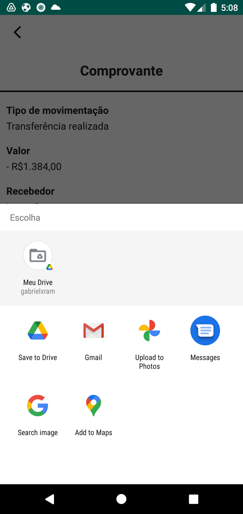
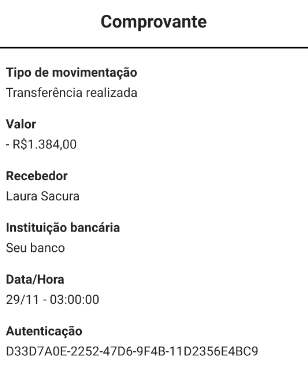
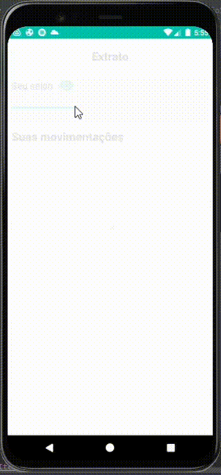

# Desafio

## Technology e Frameworks

* Kotlin
* Clean Architecture + MVVM
* [API](https://desafio-mobile-bff.herokuapp.com/)
* Retrofit
* RecyclerView
* Image sharing
* Coroutines
* Lifecycle
* Permissions

## Preview

Home

  
  

Detail

  
  

Bank statement

  

### Preview

  

